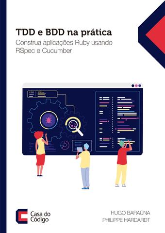

# Exemplos do livro TDD e BDD na prática - Construa aplicações Ruby usando RSpec e Cucumber

## Primeira edição:
Você pode encontrar o código da primeira edição (com o título `Cucumber e RSpec - Construa aplicações Ruby com testes e especificações utilizando TDD e BDD`) na branch [first-edition](https://github.com/hugobarauna/forca/tree/first-edition)
